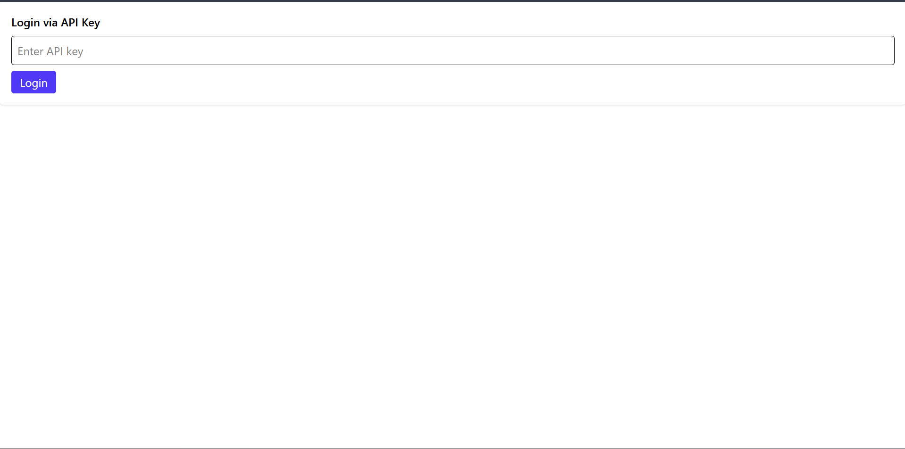
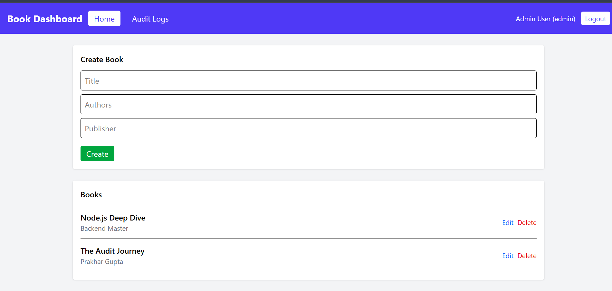
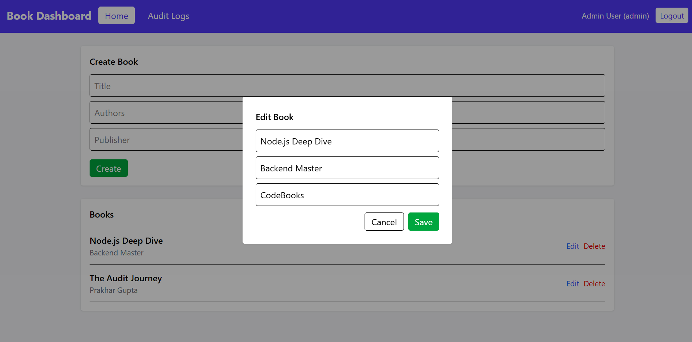
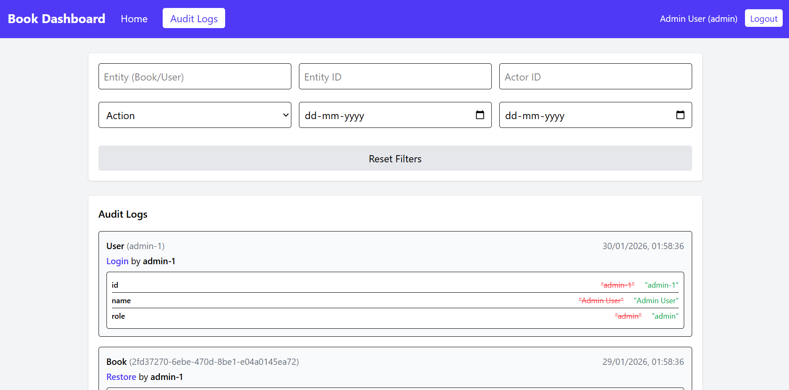

# 📚 Book Publishing System with Config‑Driven Audit Trail

A **full‑stack** application demonstrating a config‑driven audit logging system, structured observability, secure access control, and a modern React frontend.

---

# 🧩 Tech Stack

## Backend
- Fastify (Node.js)
- TypeScript (strict mode)
- Prisma ORM
- SQLite (demo DB)
- Pino logging (console, file, Elastic, Logtail)

## Frontend
- React + TypeScript
- Vite
- TailwindCSS
- Axios API layer

---

# ⚙️ Setup Steps (End‑to‑End)

### 🔹 Backend

- Install dependencies  
  ```bash
  npm install
  ```

- Create `.env`
  ```
  DATABASE_URL="file:./prisma/dev.db"
  LOG_LEVEL=info
  NODE_ENV=development
  ELASTIC_URL=
  ELASTIC_INDEX=
  LOGTAIL_TOKEN=
  ```

  Create this `.env` with elastic search config available
  ```
  DATABASE_URL="file:./prisma/dev.db"
  LOG_LEVEL=info
  NODE_ENV=development
  ELASTIC_URL=http://localhost:9200
  ELASTIC_INDEX=book-audit-logs
  LOGTAIL_TOKEN=your_logtail_token
  ```

- Run migrations  
  ```bash
  npx prisma migrate dev
  ```

- Seed database  
  ```bash
  npx prisma db seed
  ```

- Start backend  
  ```bash
  npm run dev
  ```

Backend runs at: **http://localhost:3000**

---

### 🔹 Frontend

```bash
cd frontend
npm install
npm run dev
```

Frontend runs at: **http://localhost:5173**

---

# 🧠 DB Choice Justification

### SQLite
- Zero setup — no external DB service required
- Portable file DB perfect for demos
- Relational + indexed queries supported
- Easy to reset & reseed

### Prisma
- Type‑safe queries
- Schema-driven migrations
- Clean integration with TypeScript strict mode
- Can switch to PostgreSQL without service code changes

---

# 🔐 Authentication

API Key based.

| User | API Key |
|------|--------|
| Admin | admin-api-key |
| Reviewer | reviewer-api-key |

Header:
```
x-api-key: admin-api-key
```

---

# 🧾 Audit System

Config located at:

```
src/config/audit.config.ts
```

Add new entity by:
1. Adding config entry  
2. Calling `logAudit()` in service  

Core engine remains unchanged.

---

# 📊 Logging & Observability

Configured in:

```
src/config/logger.ts
```

| Sink | Enabled By |
|------|------------|
| Pretty Console | Dev |
| File Logs | Always |
| Elasticsearch | `ELASTIC_URL` |
| Logtail | `LOGTAIL_TOKEN` |

---

# 🚀 API Examples (curl)

### Create Book

```bash
curl -X POST http://localhost:3000/api/books   -H "Content-Type: application/json"   -H "x-api-key: admin-api-key"   -d '{"title":"New Book","authors":"Author","publishedBy":"Publisher"}'
```

**Response**
```json
{
  "id": "uuid",
  "title": "New Book",
  "authors": "Author",
  "publishedBy": "Publisher"
}
```

---

### List Books

```bash
curl -H "x-api-key: admin-api-key" "http://localhost:3000/api/books?limit=5"
```

**Response**
```json
{
  "items": [...],
  "nextCursor": "cursor-id"
}
```

---

### List Audit Logs

```bash
curl -H "x-api-key: admin-api-key" "http://localhost:3000/api/audits?entity=Book&action=update"
```

**Response**
```json
{
  "items": [
    {
      "entity": "Book",
      "entityId": "uuid",
      "action": "update",
      "actorId": "admin-1",
      "diff": { "publishedBy": { "before": "A", "after": "B" } }
    }
  ]
}
```

---

# 🖥 Frontend Features

- API key login  
- Create / Edit / Delete Books  
- Paginated book list  
- Admin‑only Audit Logs page  
- Rich audit filters (entity, actor, action, date range)  
- Diff viewer with redaction  

---

# Pages Frontend

Login Page



Home Page





Audit Page




